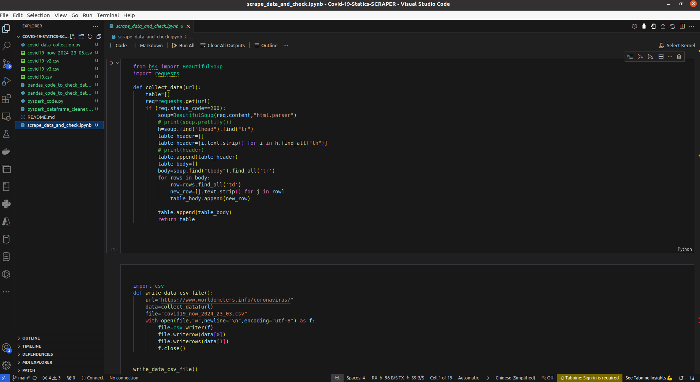
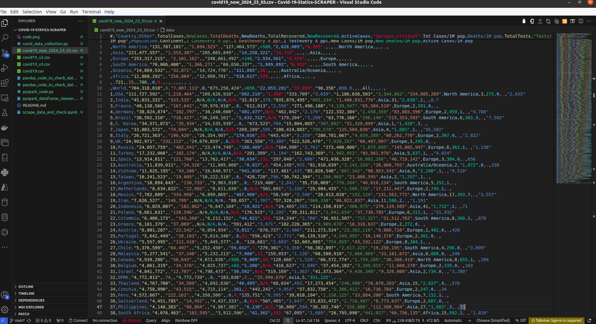

# Covid-19-Statics-SCRAPER
Covid-19 Statics SCRAPER

# COVID-19 Data Scraping and Analysis

### **COVID-19 Data Scraping and Analysis**

### **Overview**
This script scrapes COVID-19 data from [Worldometer's Coronavirus page](https://www.worldometers.info/coronavirus/) and saves it into a CSV file named "covid19_now_2024_23_03.csv". It then performs data analysis and cleaning using Python libraries such as BeautifulSoup, requests, and pandas. The cleaned data is stored in a pandas DataFrame with updated column names for better readability and understanding.

### **Setup**
Ensure you have Python installed along with the necessary libraries like `BeautifulSoup`, `requests`, `pandas`, and `csv`.

### **Usage**
1. Run the script `covid_data_collection.py` to scrape COVID-19 data and save it into a CSV file.
2. Run the script `analyze_data.py` to perform data analysis and cleaning.
3. Check the output DataFrame to view the cleaned and updated data.

### **How to Run**
1. Make sure you have installed the required libraries using `pip install -r requirements.txt`.
2. Run the scripts `covid_data_collection.py` and `analyze_data.py` in your Python environment.

### **Dependencies**
- Python 3.x
- Libraries: `BeautifulSoup`, `requests`, `pandas`

### **Notes**
- Ensure the URLs are correctly set in the scripts.
- Customize the file names and paths according to your requirements.
- Adjust the data cleaning and analysis steps as needed for your specific use case.

### **Contributors**
- [Gabin H. VEGLO](https://github.com/VEGLOhouetchenouGABIN)

### **License**
#**This project is licensed under the MIT License.**#

